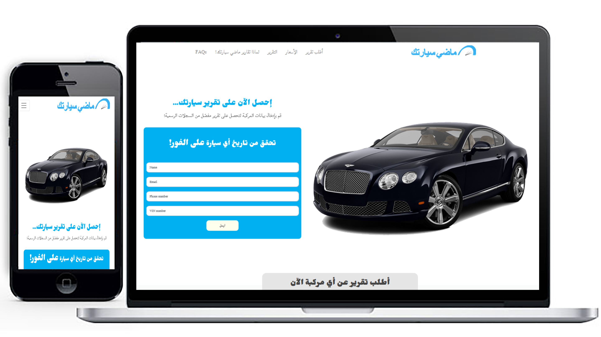

HTML Responsive Arabic Website.

I use: HTML5, CSS#, Jquery, Bootstrap4

Contens:
- Arabic RTL
- parallax scrolling for Hero Image
- Accordion for FAQ
- Menu Buttom to scroll up to the Navbar Menu when not available.

Link: http://sayarti.jthomasweb.com/index.html
github: https://github.com/joseph1mont/Madysayartak-HTML